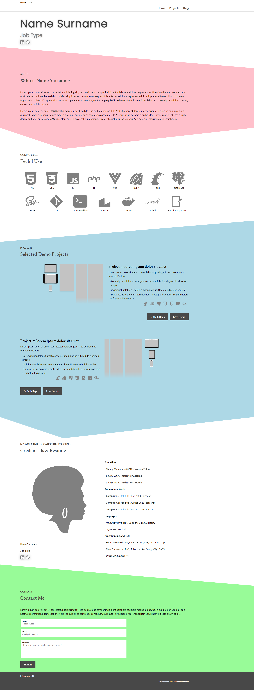
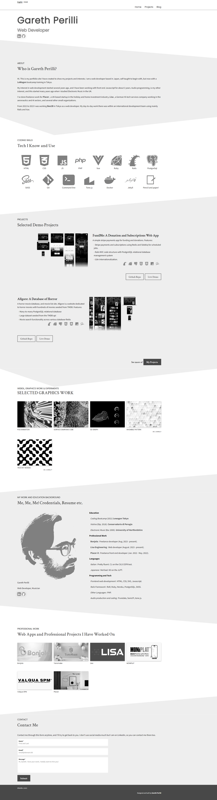

# templates-portfolio1

|   |   |
|---|---|
|    |    |
[template live demo](https://gperilli.github.io/templates-portfolio1) | [mockup live demo](https://gperilli.github.io/templates-portfolio1/mockup)


This is a HTML single page portfolio frontend template and mockup. The original design came from [https://anniebombanie.com/](https://anniebombanie.com/). I have coded this mostly from scratch, removed the testimonial section and added a few sections of my own: the professional work and graphics work sections. My modified design also includes image galleries for the projects featuring fullscreen, fullpage top-to-bottom screenshots. I use this deisgn for my own portfolio at [https://gperilli.dev](https://gperilli.dev)


## Built With
- [Vanilla JS](https://developer.mozilla.org/en-US/docs/Web/JavaScript) - vanilla Javascript
- [CSS](https://developer.mozilla.org/en-US/docs/Web/CSS)
- [HTML](https://developer.mozilla.org/en-US/docs/Web/HTML)

## Getting the project files

Either do a direct download using the download option from the code button dropdown near the top of this Github page, or use a git clone command:
```
git@github.com:gperilli/templates-portfolio1.git
```
<br>

For more information on getting git (version control system) on your local machine, see [this](https://git-scm.com/book/en/v2/Getting-Started-Installing-Git).

## Set Up a Local Development Environment

The web app will run directly on any modern web browser by opening the `index.html` file. The mockup file, `mockup.html`, features my own profile data and the grey colour scheme which I prefer.
Editing the code can be done with a simple text edtitor, or something like [Notepad++](https://notepad-plus-plus.org/). [VSCode](https://code.visualstudio.com/), probably the most popular code editor these days, can be used with the Live Server plugin which allows for near-real-time monitoring for the HTML and CSS edits.
